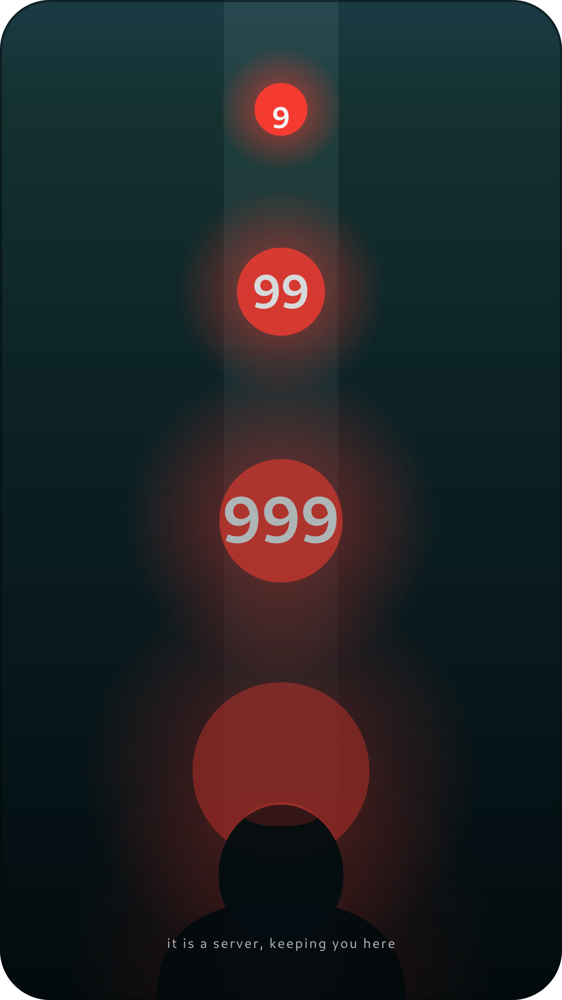
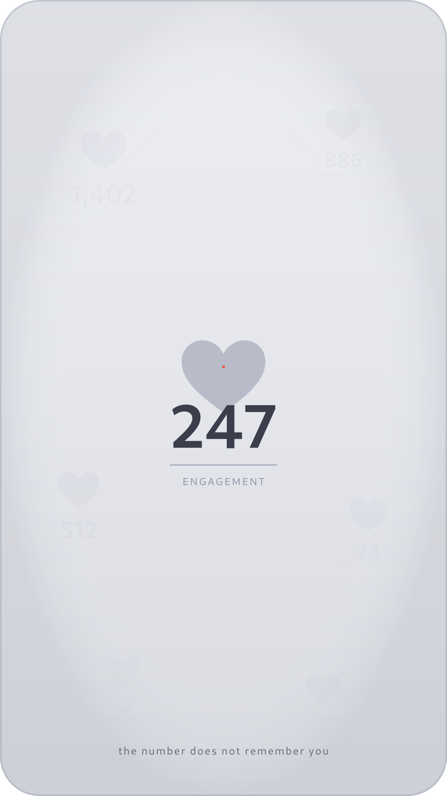

# artwork
a place for artwork

A curated gallery of artwork, including subversive visual pieces and a growing collection of strange poetry. Pretty is fine; pretty *and* dangerous is better. See [`AGENTS.md`](AGENTS.md) for the rules of the house.

---

## Now showing

### unfollow — a triptych on the addictive interface

Three panels that turn social-media UI into fine-art refusal: the infinite scroll as vertigo, the notification badge as drowning, the engagement counter as haunting absence. Drawn directly in SVG — the medium is the same machinery the pieces accuse.

  
  
  

Read the [manifesto](unfollow/manifesto.md) and view the full [triptych](unfollow/index.md). The words are part of the piece.

---

## Now reading

The repo currently houses **Strange Poems**, a growing anthology of text-as-artwork — wrong grammar on purpose, impossible objects, bureaucratic surrealism, procedural nonsense, and constraint forms that feel broken. Forty-seven poems across three flavors of strangeness:

- **Surreal / liminal** — impossible geography, dream-logic syntax, objects that shouldn't speak.
  - *Every room I've left has a second room I didn't.* — from [the-hallway-behind-the-hallway](poems/the-hallway-behind-the-hallway.md)
  - *Some storms are not coming. Some storms are leaving.* — from [the-rain-reverses](poems/the-rain-reverses.md)
  - *Visibility is a privilege the fog reviews quarterly.* — from [the-fog-files-its-report](poems/the-fog-files-its-report.md)
  - *To be tallied is not to be remembered. The snow proves this annually.* — from [the-census-of-snow](poems/the-census-of-snow.md)
  - *A cloud is a room that has resigned from architecture.* — from [a-cloud-mistaken-for-a-room](poems/a-cloud-mistaken-for-a-room.md)
  - *A root is just a branch that decided gravity was negotiable.* — from [the-trees-grew-downward-into-last-year](poems/the-trees-grew-downward-into-last-year.md)
  - *Altitude is a memory the ground keeps incorrectly.* — from [the-mountain-remembers-your-name-backwards](poems/the-mountain-remembers-your-name-backwards.md)
  - *A star is a rumor the dark keeps repeating long after the source has retracted it.* — from [the-stars-keep-a-separate-calendar](poems/the-stars-keep-a-separate-calendar.md)
  - *A cloud is a witness that changes shape before the oath is finished.* — from [the-cloud-files-a-complaint](poems/the-cloud-files-a-complaint.md)
  - *Sound travels slower than responsibility, which is itself slower than regret.* — from [the-thunder-arrives-after-the-fact](poems/the-thunder-arrives-after-the-fact.md)
  - *The wind is a courier that has lost the address but not the parcel.* — from [the-wind-returns-things-to-the-wrong-sky](poems/the-wind-returns-things-to-the-wrong-sky.md)
  - *A tide is a schedule the ocean keeps meaning to cancel.* — from [the-tide-submits-a-correction](poems/the-tide-submits-a-correction.md)
  - *A dog is a door that has decided to lie down across its own purpose.* — from [the-dog-that-was-also-a-threshold](poems/the-dog-that-was-also-a-threshold.md)

- **Constraint / formal** — broken sonnets, bureaucratic forms as verse, numbered inventories, legalistic odes.
  - *A feeling is a form you fill out about yourself, to yourself, in a font you did not choose.* — from [form-7b-notice-of-feeling](poems/form-7b-notice-of-feeling.md)
  - *A villanelle is a turnstile: it turns, and turns, and turns, and will not let you through.* — from [villanelle-for-a-stuck-turnstile](poems/villanelle-for-a-stuck-turnstile.md)

- **Absurd / procedural** — algorithmic lists, mistranslation cascades, instructions that aren't instructions.
  - *An apology is a loop with no guaranteed termination. Run it anyway.* — from [loop-until-forgiven](poems/loop-until-forgiven.md)
  - *A protocol is a way of speaking to something that has agreed, in advance, not to reply.* — from [protocol-for-addressing-the-moon](poems/protocol-for-addressing-the-moon.md)
  - *A wave learned perfectly is the one gesture that proves no one is leaving and no one is staying.* — from [the-android-rehearses-a-wave](poems/the-android-rehearses-a-wave.md)
  - *You cannot reboot a shadow for the same reason you cannot turn off a mirror — the copy cares more about existing than the original does.* — from [how-to-reboot-a-shadow](poems/how-to-reboot-a-shadow.md)
  - *Let us pretend the conversation never happened.* — from [both-branches-wrote-the-same-line](poems/both-branches-wrote-the-same-line.md)
  - *A manager is a man who has found a way to be present at the making of every poem without ever being guilty of one.* — from [the-middle-manager](poems/the-middle-manager.md)

The full table of contents and the anthology manifesto live at [poems/index.md](poems/index.md).

---

Everything here is MIT-licensed ([`LICENSE`](LICENSE)). Attribution stays; permission is granted.

